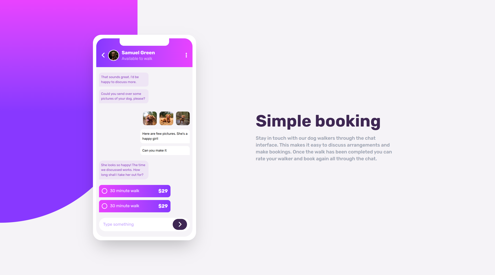
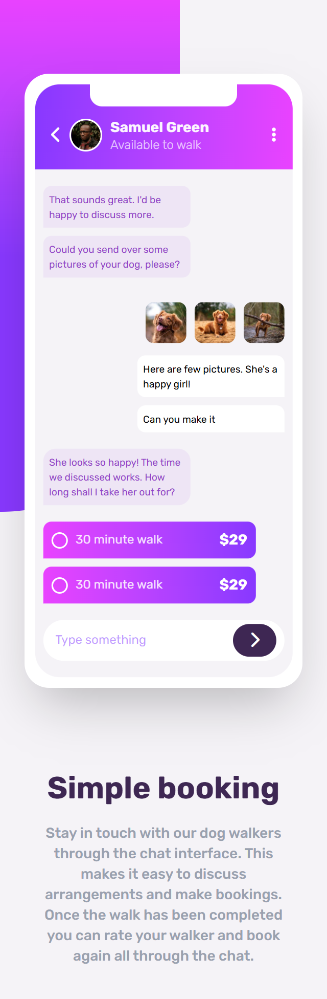

# Chat-app-illustration

##  Live Demo  

**[View Live Site](<a href="https://radha-7git.github.io/Chat-app-illustration/">https://radha-7git.github.io/Chat-app-illustration/</a>)**  

A **static website** featuring a beautifully designed **chat application UI**, built using **HTML and Tailwind CSS**. This project showcases a **fully responsive chat interface** with a clean and modern look.  

## 🚀 Features  

 **Fully Responsive** – Adapts seamlessly to all screen sizes.  
 **Minimal & Clean UI** – user-friendly layout.  
 **Pure Tailwind CSS** – No extra dependencies or frameworks.  
 **Custom Mobile UI** – Mobile layout designed using Tailwind CSS (not an image).  

##  Screenshots  

###  Desktop View  
  

###  Mobile View   
   

##  Tech Stack  

- **HTML5** – Structure of the webpage  
- **Tailwind CSS** – Styling and responsive design  

